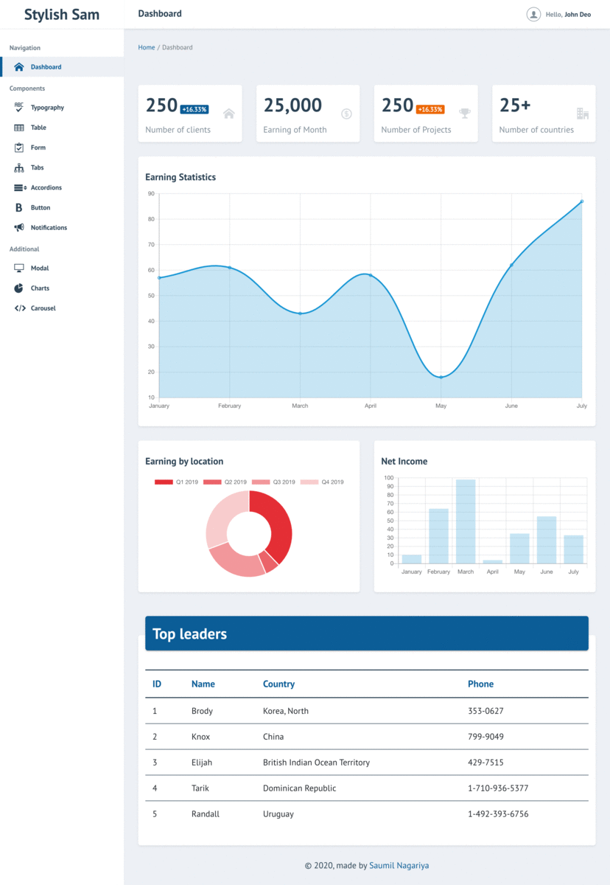

# Stylish Sam - Dashboard System
The Dashboard System/Admin Panel is based on Bootstrap 4, Javascript, jQuery, SCSS, bootstrap-notify.js & chart.js.
   
# Benefits:

- Easy to change look & feel of dashboard system/admin panel. 
- Currently there are four different color variation.(i.e. style-01.css, style-02.css, style-03.css & style-04.css)
- All bootstrap components are supported.
- The responsive version needs to be check in actual device (Check & update in next release.)
- I have uploaded compiled HTML files here. Actually I built this admin panel in PHP (on my local system).

# Collections:

- Typography
- Table
- Form
- Tabs
- Accordions (Single & Multiple options enable)
- Button
- Notifications (bootstrap-notify.js)
- Modal
- Charts (Line chart, Bar chart, Pie chart, Donut chart, Radar chart & Polar chart)
- Carousel

# Preview:

# Colour Variation:

